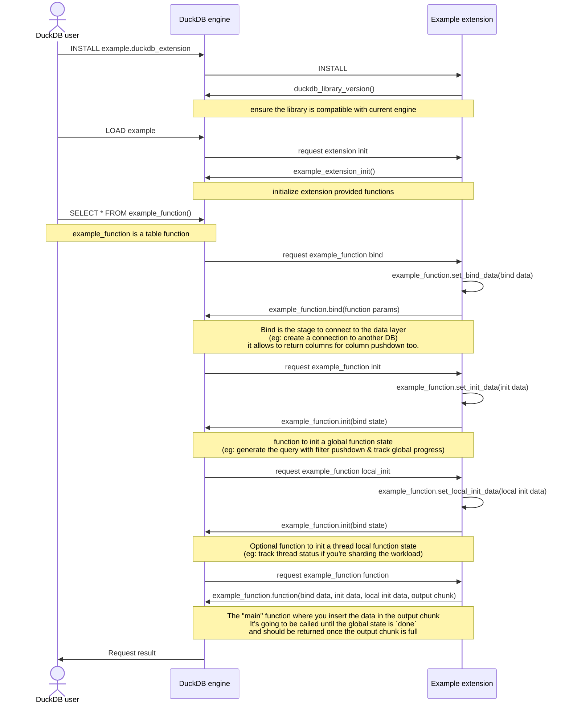

# duckdb-extension-workflow

## Table function workflow

Here is the workflow of a table function in DuckDB from the user perspective.
Let's assume that the extension is called `example extension` and it implements a table function called `example_function`.

